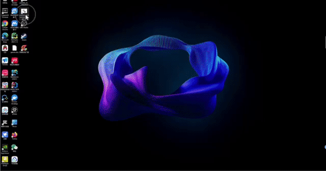

- 
- [MoneyPrinterPlus](#moneyprinterplus)
- [视频教程](#视频教程)
- [界面概览](#界面概览)
- [已实现功能](#已实现功能)
- [待实现功能](#待实现功能)
- [实例展示](#实例展示)
- [使用方法](#使用方法)
  - [环境要求](#环境要求)
  - [安装](#安装)
  - [运行](#运行)
    - [基本配置](#基本配置)
  - [AI视频](#ai视频)
    - [生成视频文案](#生成视频文案)
    - [视频配音和背景音乐](#视频配音和背景音乐)
    - [视频配置](#视频配置)
    - [字幕配置](#字幕配置)
    - [生成视频](#生成视频)
- [常见问题和解决方案](#常见问题和解决方案)
- [讨论组](#讨论组)
- [系列教程](#系列教程)


# MoneyPrinterPlus

这是一个轻松赚钱的项目。

短视频时代，谁掌握了流量谁就掌握了Money!

所以给大家分享这个经过精心打造的MoneyPrinter项目。

**它可以：使用AI大模型技术,一键批量生成各类短视频。**

**它可以：一键混剪短视频，批量生成短视频不是梦。**

**它可以：自动把视频发布到抖音,快手,小红书,视频号上。**

赚钱从来没有这么容易过!

觉得有用的朋友，请给个star! 

# 视频教程

## 简单介绍

[MoneyPrinterPlus一键AI短视频生成工具开源啦](https://www.bilibili.com/video/BV16VVGefEp1/?spm_id_from=333.999.0.0&vd_source=a563b6c970df6e7665845c15089bd618)

## 详细介绍

[MoneyPrinterPlus AI视频工具详细使用说明](https://www.bilibili.com/video/BV1JKgYe5ERF/?pop_share=1&vd_source=a563b6c970df6e7665845c15089bd618)

## 批量短视频生成介绍

[MoneyPrinterPlus AI批量短视频混剪工具使用说明](https://www.bilibili.com/video/BV1v43eekECn/?spm_id_from=333.999.0.0&vd_source=a563b6c970df6e7665845c15089bd618)

## 小白使用教程

[MoneyPrinterPlus小白使用教程来啦!一键万条短视频](https://www.bilibili.com/video/BV1XgaKeGEFb/)

# 图文系列教程

[moneyPrinterPlus简介](https://mp.weixin.qq.com/s/0p9T_WFJ_yXcj74TgI7iMw)

[moneyPrinterPlus详细使用教程](https://mp.weixin.qq.com/s/fAdws2grcZknG8VLQfjMjg)

[moneyPrinterPlus阿里云详细配置使用教程](https://mp.weixin.qq.com/s?__biz=MzIxMTI0NzcyMQ==&mid=2650935498&idx=1&sn=7d29a350f36e14686252e9a22d8fce23&chksm=8cae87ccbbd90edaea45b595ec4028b91e464061c0a2f37f1f15e97f593fd7b51edba765ed6e&cur_album_id=1821975747683532806&scene=189#wechat_redirect)

[moneyPrinterPlus腾讯云详细配置使用教程](https://mp.weixin.qq.com/s/VaI-Fy7dDz9dlW5tGM4mhg)

[moneyPrinterPlus微软云详细配置使用教程](https://mp.weixin.qq.com/s/4p6MuDcwIurpVwkcQlWoDA)

[重磅!免费一键批量混剪工具它来了,一天上万短视频不是梦](https://mp.weixin.qq.com/s/gUB18fTwRUvo9dSgk0DXLg)

[MoneyPrinterPlus自动配置环境和自动运行](https://mp.weixin.qq.com/s/k3B08ol1GJVi2EIyfCgWAg)


# 界面概览

## 1. AI视频批量混剪工具


使用介绍：
[重磅!免费一键批量混剪工具它来了,一天上万短视频不是梦](https://mp.weixin.qq.com/s/gUB18fTwRUvo9dSgk0DXLg)

## 2. AI视频生成器


## 3. 批量视频自动上传工具




# 更新预告

* 视频自动发布功能已经上线了！！！！


# 更新列表

- 20240708 逆天了！自动发布视频功能上线了。支持抖音，快手，小红书，视频号！！！
- 20240704 添加自动安装和自动启动脚本，方便小白使用。
- 20240628 重磅更新！支持批量视频混剪，批量生成大量不重复的短视频!!!!!!
- 20240620 优化视频合成效果，让视频结束更加自然。
- 20240619 语音识别和语音合成**支持腾讯云**。 需要开通腾讯云语音合成和语音识别这两个功能
- 20240615 语音识别和语音合成**支持阿里云**。 需要开通阿里云智能语音交互功能--必须开通语音合成和录音文件识别（极速版）这两个功能
- 20240614 资源库支持pixabay,支持语音试听功能,修复一些bug

# 已实现功能

- [x] 视频批量自动发布到各个视频平台,支持抖音，快手，小红书，视频号！！！
- [x] 视频批量混剪，批量产出大量不重复的短视频
- [x] 支持本地素材选择(支持各种素材mp4,jpg,png),支持各种分辨率。
- [x] 大模型接入OpenAI,Azure,Kimi,Qianfan,Baichuan,Tongyi Qwen, DeepSeek,
- [x] 支持**Azure**语音功能
- [x] 支持**阿里云**语音功能
- [x] 支持**腾讯云**语音功能
- [x] 支持100+不同的语音种类
- [x] 支持语音试听功能
- [x] 支持30+种**视频转场特效**
- [x] 支持不同分辨率，不同尺寸和比例的视频生成
- [x] 支持语音选择和语速调节
- [x] 支持背景音乐
- [x] 支持背景音乐音量调节
- [x] 支持自定义字幕
- [x] 覆盖市面上主流的AI大模型工具

# 待实现功能

- [] 支持本地语音字幕识别模型
- [] 支持更多的视频资源获取方式
- [] 支持更多的视频转场特效
- [] 支持更多的字幕特效
- [] 接入stable diffusion，AI生图，合成视频
- [] 接入Sora等AI视频大模型工具，自动生成视频

# 实例展示

<table>
<thead>
<tr>
<th align="center">竖屏</th>
<th align="center">横屏</th>
<th align="center">正方形</th>
</tr>
</thead>
<tr>
<td align="center"><video  src="https://github.com/ddean2009/MoneyPrinterPlus/assets/13955545/d96e5e50-cfe7-4f55-a0db-75f3ac28b39f"></video></td>
<td align="center"><video  src="https://github.com/ddean2009/MoneyPrinterPlus/assets/13955545/714b122d-d857-4132-bdd3-9f07c9aa787b"></video></td>
<td align="center"><video  src="https://github.com/ddean2009/MoneyPrinterPlus/assets/13955545/2ec748c2-8145-4178-ae48-a3114290addd"></video></td>
</tr>
</table>

# 使用方法

## 环境要求

- Python 3.10+
- ffmpeg 6.0+
- LLM api key
- Azure语音服务(https://speech.microsoft.com/portal) 
- 或者阿里云智能语音功能(https://nls-portal.console.aliyun.com/overview)
- 或者腾讯云语音技术功能(https://console.cloud.tencent.com/asr)

> 切记！！！！！ 一定要安装好ffmpeg,并把ffmpeg路径添加到环境变量中。

## 安装

### 前提条件

1. 确保你有Python 3.10+的运行环境。如果是windows, 请确保安装了python路径已经添加到了PATH中。
2. 确保你有ffmpeg 6.0+的运行环境。如果是windows, 请确保安装了ffmpeg路径已经添加到了PATH中。没有安装ffmpeg的朋友，请通过 https://ffmpeg.org/ 来安装对应的版本。


### 手动安装

如果python和ffmpeg环境都有了。那么就可以通过pip安装依赖包了。

```bash
pip install -r requirements.txt
```

### 自动安装

进入项目目录，windows下双击执行：

```bash
setup.bat
```

mac或者linux下执行：

```bash
bash setup.sh
```

## 运行

使用下面命令运行程序:

```bash
streamlit run gui.py
```

### 自动运行

如果你使用了自动安装脚本，那么可以执行下面的脚本来自动运行。

windows下,双击 start.bat

mac或者linux下执行：

```bash
bash start.sh
```

在日志文件中可以看到程序运行的日志信息。

里面有浏览器的地址，可以通过浏览器打开这个地址来访问程序。

打开之后，你会看到下面的界面：


左侧目前有三项配置， 分别是基本配置，AI视频和混剪视频(开发中)。

### 基本配置

#### 1. 资源库

目前资源支持：

* pexels:  [www.pexels.com](https://www.pexels.com/)  **Pexels** 是世界上著名的免费图片，视频素材网站。
* pixabay: [pixabay.com](https://pixabay.com/) 

大家需要到对应的网站上注册一个key来实现API调用。

>  后续会陆续添加其他资源库。如（[videvo.net](https://www.videvo.net)，[videezy.com](https://www.videezy.com) 等）
>
>  

#### 2. 音频库

目前文字转语音和语音识别功能支持：
1. Azure的cognitive-services服务。
2. 阿里云的智能语音交互
3. 腾讯云语音技术功能(https://console.cloud.tencent.com/asr)

* Azure：

大家需要到  https://speech.microsoft.com/portal  这里注册一个key。

Azure对新用户是1年免费的。费用也是比较便宜。

* 阿里云：

大家需要到 https://nls-portal.console.aliyun.com/overview 这里开通服务，并添加一个项目。

需要开通阿里云智能语音交互功能--必须开通语音合成和录音文件识别（极速版）这两个功能.

* 腾讯云：

腾讯云语音技术功能(https://console.cloud.tencent.com/asr) 开通语音识别和语音合成功能。


>  后续会添加本地语音识别大模型。但是文字转语音还是微软的服务最为优秀。


#### 3. LLM大模型

大模型区目前支持Moonshot,openAI,Azure openAI,Baidu Qianfan, Baichuan,Tongyi Qwen, DeepSeek这些。 

> 推荐使用Moonshot。 
>
> 会陆续添加市面上其他流行的大模型。


Moonshot API获取地址： https://platform.moonshot.cn/ 

baidu qianfan API获取地址：https://cloud.baidu.com/doc/WENXINWORKSHOP/s/yloieb01t

baichuan API获取地址： https://platform.baichuan-ai.com/ 

阿里tongyi qwen API获取地址： https://help.aliyun.com/document_detail/611472.html?spm=a2c4g.2399481.0.0

DeepSeek API获取地址: https://www.deepseek.com/

## AI视频

基本配置设置完毕之后。就可以进入到AI视频了。 

### 生成视频文案

首先，我们给一个关键词，然后用大模型生成视频文案：


可以选择视频的文案语言，视频时长。

如果大家对视频文案和关键词不满意的话，可以手动修改。

### 视频配音和背景音乐


可以选择配音的语言和配音的语音。

还支持配音语速调节。

> 后续会支持语音试听功能。

背景音乐放在项目的bgmusic文件夹中。

目前里面只有两个背景音乐。大家可以自行添加自己需要的背景应用。

### 视频配置

视频配置区，大家可以选择视频的布局，视频帧率，视频尺寸。

视频片段最小长度和最大长度。

还可以开启视频转场效果。目前支持30+转场效果。


> 后续会添加使用本地视频资源功能。

### 字幕配置

字幕文件位于项目根目录的fonts文件夹。

目前支持宋体和苹方两个字体集合。


可以选择字幕位置，字幕颜色，字幕边框颜色和字幕边框宽度。

### 生成视频

最后，就可以点击生成视频生成视频了。

会在页面上列出具体的步骤名称和进度。


生成视频完成后，视频会显示在最下方，大家直接可以播放观看效果。


# 常见问题和解决方案

遇到问题的朋友，可以先看看这里的问题汇总，看看能不能解决问题先。

[常见问题汇总](issue.md)

# 讨论组

如果大家有什么问题或者想法，欢迎入群讨论。


